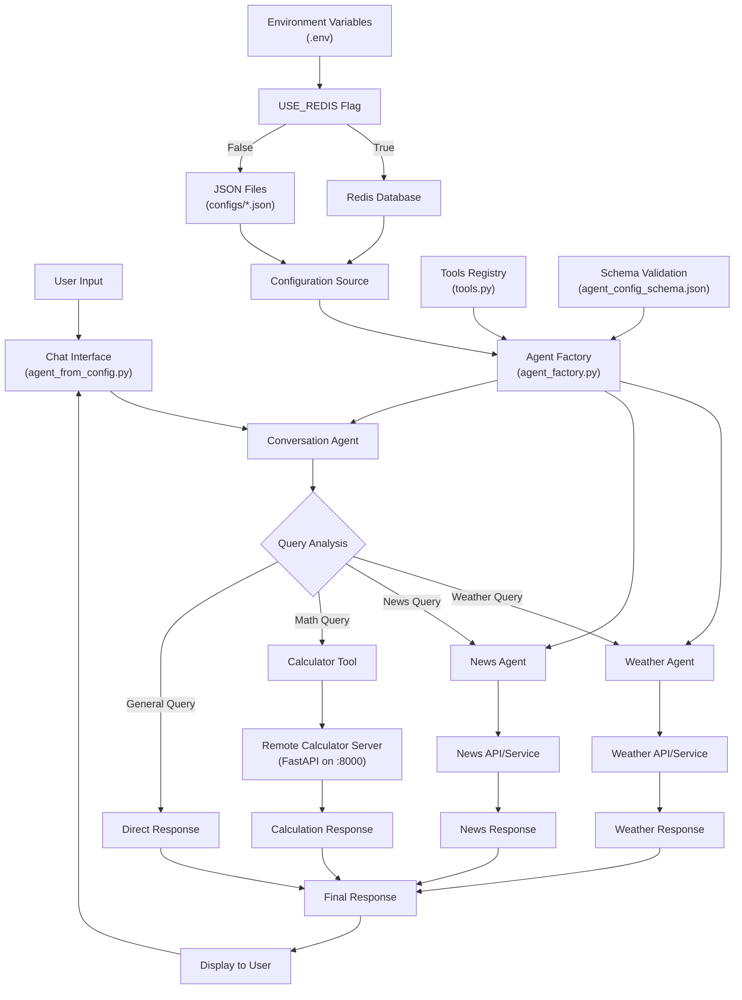

# AI Agent Framework

A flexible Python framework for creating configurable AI agents that can work together as tools. This project allows you to define specialized agents (like weather and news agents) and combine them into a conversation agent that can intelligently route queries to the appropriate specialist agent.

## Architecture Overview

## Features

- **Configurable Agents**: Define agents using JSON configuration files
- **Agent Composition**: Use specialized agents as tools within other agents
- **Flexible Storage**: Store configurations in files or Redis
- **Schema Validation**: Automatic validation of agent configurations
- **Interactive Chat**: Built-in chat interface for testing agents
- **Extensible Tools**: Easy to add new tools and capabilities

## Project Structure

- **agent_factory.py**: Core factory for creating agents from configurations
- **agent_from_config.py**: Main entry point with chat interface
- **configs/**: JSON configuration files for different agent types
  - **conversation.json**: Configuration for the main conversation agent
  - **weather.json**: Configuration for weather-specific agent
  - **news.json**: Configuration for news-specific agent
  - **agent_config_schema.json**: Schema for validating agent configurations
- **tools.py**: Available tools that agents can use
- **remote/**: Remote functionality and API endpoints

## Setup

1. **Install Dependencies**
   
   Install the required Python packages:
   
   pip install -r requirements.txt

2. **Environment Configuration**
   
   Copy the example environment file and configure it:
   
   cp env.example .env
   
   Edit .env and add your OpenAI API key:
   - Set OPENAI_API_KEY to your actual OpenAI API key
   - Set USE_REDIS to True if you want to use Redis for configuration storage (default: False)

3. **Redis Setup (Optional)**
   
   If you want to use Redis for configuration storage:
   - Install Redis on your system
   - Start Redis service
   - Set USE_REDIS=True in your .env file
   - Use store_configs_redis.py to load configurations into Redis

## Usage

### Basic Usage

Run the main chat interface:

python agent_from_config.py

This will start an interactive chat session where you can:
- Ask weather-related questions (routed to weather agent)
- Ask for news information (routed to news agent)
- Have general conversations (handled by conversation agent)
- Type 'exit' to end the session

### Remote Server Setup (for Calculator Tools)

To use the calculator functionality:

1. Start the remote calculator server:

   python remote/calculator.py

   This will start a FastAPI server on http://localhost:8000 that provides:
   - Square root calculations
   - Health check endpoint at /health

2. The calculator will now be available as a tool in the conversation agent
   - You can ask mathematical questions like "What is the square root of 25?"
   - The conversation agent will route these to the calculator service

Note: The remote calculator server must be running for calculator functionality to work. If the server is not running, calculator-related queries will fail although the conversation agent might try to answer on its own.

### How It Works

1. **Specialized Agents**: The system creates weather and news agents from their respective JSON configurations
2. **Agent Composition**: These specialized agents are added as tools to a conversation agent
3. **Intelligent Routing**: The conversation agent determines which tool/agent to use based on user queries
4. **Tool Execution**: When a specialized agent is needed, it's executed and results are returned to the user

### Configuration

Agent configurations are stored in JSON files in the configs/ directory. Each configuration includes:

- **name**: Agent identifier
- **instructions**: System prompt defining the agent's behavior
- **model**: OpenAI model to use (e.g., "gpt-4o-mini")
- **tools**: List of available tools the agent can use

The configuration schema is validated automatically using agent_config_schema.json.

### Adding New Agents

1. Create a new JSON configuration file in the configs/ directory
2. Define the agent's name, instructions, model, and tools
3. Add the agent to your code using create_agent_from_config()
4. Optionally add it as a tool to other agents

## Configuration Storage Options

### File-based Storage (Default)
Configurations are read from JSON files in the configs/ directory.

### Redis Storage
Set USE_REDIS=True to store configurations in Redis. This enables:
- Dynamic configuration updates
- Centralized configuration management
- Better performance for frequent configuration reads

## Requirements

- Python 3.8+
- OpenAI API key
- Redis (optional, for Redis-based configuration storage)

## Dependencies

Key dependencies include:
- openai-agents: Core agent framework
- openai: OpenAI API client
- redis: Redis client (for Redis storage)
- jsonschema: Configuration validation
- python-dotenv: Environment variable management

See requirements.txt for the complete list of dependencies and versions.

## Error Handling

The framework includes comprehensive error handling for:
- Missing configuration files
- Invalid JSON configurations
- Schema validation failures
- Redis connection issues
- OpenAI API errors
- Missing tools or dependencies

All errors include descriptive messages to help with troubleshooting. 